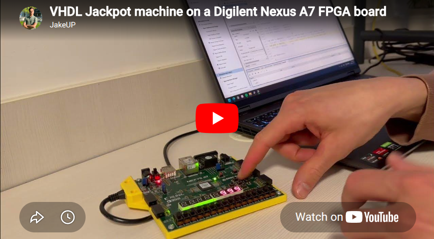
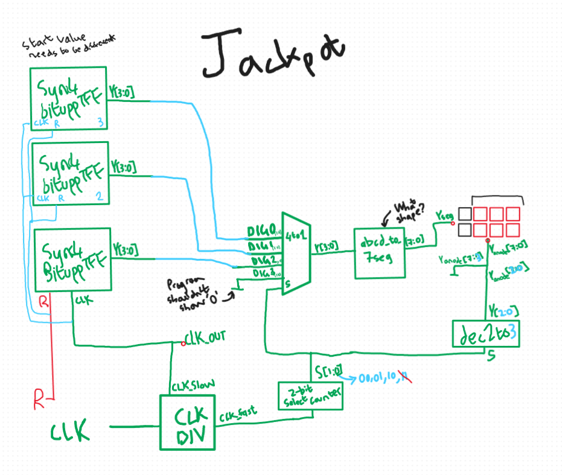

# VHDL Jackpot Mackine on Digilent Nexus A7 FPGA board

A digital slot machine implemented in VHDL for the Xilinx Nexus A7 FPGA board. Press three buttons to stop the counters—if all three digits match, you've hit the jackpot! The display flashes (via PWM) to celebrate your win.

## 📋 Project Overview

This project implements a classic three-digit jackpot machine using synchronous counters, multiplexing, and state machines. When three independent 3-bit counters are running and you press buttons to stop them individually, the system checks if all three digits are equal. If they are, the 7-segment display flashes rapidly, and RGB LEDs light up to indicate your jackpot win.

[](https://youtu.be/ZC89R0Oh2PM?si=pRp1y0WykItvzwdK)

### Key Features
- **Three Independent 3-Bit Counters** (0-7 cycle): Each controlled by a separate button press
- **Real-Time Display Multiplexing**: Three 7-segment displays show all digits simultaneously
- **Jackpot Detection**: Automatic comparison of all three digits
- **Visual Feedback**: 
  - RGB LEDs blink to indicate matching digit pairs
  - 7-segment display flashes at jackpot using PWM (Pulse Width Modulation)
- **State Machine Control**: Robust handling of button presses and game states
- **Clock Dividers**: Multiple clock frequencies for different timing requirements

---

## 🏗️ Architecture & How It Works

### System Block Diagram


### Detailed Component Description

#### **1. Clock Divider (`clk_div.vhd`)**
Derives three different clock speeds from the main 100 MHz clock:
- **CLK_OUT1 (clk_slow)**: BUF[20] → ~48 Hz (slow counter increment)
- **CLK_OUT2 (clk_med)**: BUF[18] → ~191 Hz (medium speed)
- **CLK_OUT3 (clk_fast)**: BUF[12] → ~24 kHz (fast multiplexing & state control)

The fast clock enables rapid display updates (multiplexing) and state transitions.

#### **2. Synchronous 3-Bit Counters (`sync4bitupTff.vhd` & `Tff.vhd`)**
Three identical 3-bit binary up-counters built from **Toggle Flip-Flops (TFFs)**:
- **Range**: 0 → 7 (cycles continuously when enabled)
- **Control**: Clock gated by `cnt_run_state` signal
  - When `cnt_run_state[i] = '1'` → counter runs
  - When `cnt_run_state[i] = '0'` → counter stops (button pressed)
- **Output**: 3-bit value on `Y[2:0]`

**Counter Logic**:
```vhdl
T(0) <= '1';              -- LSB always toggles
T(1) <= Q(0);             -- Toggle when Q(0) = 1
T(2) <= Q(1) and Q(0);    -- Toggle when Q(1)=1 AND Q(0)=1
```

#### **3. 7-Segment Display (`abcd_to_7seg.vhd`)**
Converts 4-bit BCD input to 7-segment display format:
- **Inputs**: 4-bit number (0-9), DisplayPwr signal (for flashing)
- **Outputs**: 7 segment signals (a-g) + decimal point
- **Control**: When `DisplayPwr = '0'`, all segments go dark (enables PWM flashing)

#### **4. Multiplexer (`MUX.vhd`)**
Time-division multiplexes three 3-bit counter outputs onto a single 4-bit bus:
- **Selector Signal** `S[1:0]` (2-bit counter) cycles through positions
- **Outputs**: Cycles between Digit0, Digit1, Digit2
- **Speed**: Updates at clk_fast rate for seamless display

#### **5. Decoder (`dec2to4.vhd`)**
Converts 2-bit selector to 3-bit anode control:
- Selects which of the 3 seven-segment displays is active
- One display active at a time (updated sequentially)

#### **6. Jackpot State Machine (`JackpotMachine.vhd`)**
The brain of the system. Manages the entire game flow with 7 states:

**States:**
```
Running
  ↓ (button pressed)
Stop0 / Stop1 / Stop2
  ↓ (stop bit cleared)
Running
  ↓ (all counters stopped: cnt_run_state = "000")
Results
  ↓ (if Yctr0 = Yctr1 = Yctr2: JACKPOT!)
  → EN_Flash7Seg = '1' → Display flashes
  ↓ (Clear button pressed)
Clear
  ↓ (wait for stabilization)
Running (restart)

Reset (on power-up or reset button)
  ↓
Clear → Running
```

**Key Signals:**
- **`cnt_run_state[2:0]`**: Each bit controls if a counter runs
  - Bit 0: Counter 0 enable
  - Bit 1: Counter 1 enable
  - Bit 2: Counter 2 enable
- **`EN_Flash7Seg`**: High during jackpot to enable PWM flashing
- **`RGB_LEFT_color_state`, `RGB_RIGHT_color_state`**: Control LED colors (00=off, 10=red)

**RGB LED States:**
- When Button 0 is pressed and Button 1 hasn't caught up: Light LEFT LED (comparing digits 0-1)
- When Button 1 is pressed and Button 2 hasn't caught up: Light RIGHT LED (comparing digits 1-2)
- When JACKPOT detected: Both active (all three digits match)

#### **7. RGB LED Controller (`RBG_leds.vhd`)**
Controls RGB LED brightness and color:
- **PWM Control**: Counter-based on fast clock
- **Color States**:
  - `00`: Off (all dark)
  - `01`: Green
  - `10`: Red (used for jackpot indication)
  - `11`: Yellow (both red and green)
- **Blinking**: PWM duty cycle creates pulsing effect

#### **8. 7-Segment Display PWM (`JackpotMachine.vhd`, lines 310-330)**
Implements flashing via Pulse Width Modulation:
```vhdl
if EN_Flash7Seg = '1' then
    disp_counter <= disp_counter + 1;
    if (disp_counter = 10000) then
        tmpDisplayPwr <= '1';     -- Display ON
    elsif (disp_counter = 5000) then
        tmpDisplayPwr <= '0';     -- Display OFF
    end if;
end if;
```
- Period: 10,000 clock cycles
- Duty: 50% (5000 ON, 5000 OFF)
- Creates visible 0.4 Hz flash effect

---

## 🎮 How to Play

1. **Power On**: Board initializes, counters start running (display shows rolling digits)
2. **Press Button 0**: Counter 0 stops; LEFT RGB LED lights red if digits 0-1 match
3. **Press Button 1**: Counter 1 stops; LEFT RGB LED lights if digits 0-1 match; RIGHT LED lights if digits 1-2 match
4. **Press Button 2**: Counter 2 stops; RIGHT RGB LED lights if digits 1-2 match
5. **Jackpot Check**: If all three digits are equal → **7-segment display FLASHES**
6. **Press Clear Button**: Reset and play again

### Example Winning Scenario
```
Counter 0: 5
Counter 1: 5  ← Matches counter 0 (LEFT LED lights)
Counter 2: 5  ← Matches counters 0 & 1 (RIGHT LED lights)
Result: JACKPOT! Display flashes at ~0.4 Hz
```

---

## 🔌 Pin Configuration (Nexus A7)

### Inputs
| Pin | Signal | Function |
|-----|--------|----------|
| E3 | CLK | 100 MHz system clock |
| D9 | JackBTN[0] | Stop Counter 0 |
| C9 | JackBTN[1] | Stop Counter 1 |
| B9 | JackBTN[2] | Stop Counter 2 |
| D10 | Jack_Clear_BTN | Reset game |
| C11 | R | Reset signal (active high) |

### Outputs - 7-Segment Displays
| Pin | Signal | Function |
|-----|--------|----------|
| A13 | Yseg7[0] | Segment a |
| A14 | Yseg7[1] | Segment b |
| D13 | Yseg7[2] | Segment c |
| D14 | Yseg7[3] | Segment d |
| E14 | Yseg7[4] | Segment e |
| E13 | Yseg7[5] | Segment f |
| F14 | Yseg7[6] | Segment g |
| F13 | Yseg7[7] | Decimal point |

### Outputs - Anode Control
| Pin | Signal | Function |
|-----|--------|----------|
| C17 | Yan7[0] | Digit 0 select (ones) |
| D18 | Yan7[1] | Digit 1 select (tens) |
| E18 | Yan7[2] | Digit 2 select (hundreds) |
| G17 | Yan7[3-7] | Unused |

### Outputs - RGB LEDs
| Pin | Signal | Function |
|-----|--------|----------|
| N16, N15, L16 | RGBout[2:0] | RIGHT LED (RGB) |
| M17, L17, L14 | RGBout2[2:0] | LEFT LED (RGB) |

### Debug Outputs
| Pin | Signal | Function |
|-----|--------|----------|
| V11 | CLK_OUT | Slow clock (visual debugging) |
| M14, N14 | Yout[1:0] | Counter 0 output |
| L13, L14 | tmpcnt_run_state[1:0] | Counter run state |

---

## 📁 File Structure

```
jackpot_machine/
├── main.vhd                 # Top-level module (instantiates all components)
├── JackpotMachine.vhd       # State machine controller
├── clk_div.vhd              # Clock divider (3 output frequencies)
├── sync4bitupTff.vhd        # 3-bit synchronous counter (TFF-based)
├── Tff.vhd                  # Toggle flip-flop primitive
├── abcd_to_7seg.vhd         # 4-bit to 7-segment decoder
├── MUX.vhd                  # 3-to-1 multiplexer
├── dec2to4.vhd              # 2-to-3 decoder (anode control)
├── RBG_leds.vhd             # RGB LED PWM controller
├── bin4_to_bcd5.vhd         # Binary to BCD converter (unused in current design)
├── README.md                # This file
└── Nexus_A7.xdc             # Pin configuration (not included)
```

---

## ⚙️ Implementation Details

### Counter Control Logic
```vhdl
-- From JackpotMachine.vhd, lines 300-302
CLK_slow_ctr(0) <= clk_slow and cnt_run_state(0);
CLK_slow_ctr(1) <= clk_slow and cnt_run_state(1);
CLK_slow_ctr(2) <= clk_slow and cnt_run_state(2);
```
Each counter's clock is AND'ed with its enable bit. When the bit is '0' (button pressed), the counter stops.

### Display Multiplexing Timing
- Fast clock: ~24 kHz
- 2-bit selector cycles: 0 → 1 → 2 → 3 → 0
- Only 3 displays connected, so selector rapidly cycles through them
- Human eye perceives all digits simultaneously (persistence of vision)

### Jackpot Detection
```vhdl
-- From JackpotMachine.vhd, lines 219
if (Yctr0 = Yctr1) and (Yctr1 = Yctr2) and R = '0' then
    EN_Flash7Seg <= '1';   -- Enable PWM flashing
end if;
```

### State Machine Implementation
- Uses synchronous design (clock-gated state transitions)
- Prevents race conditions by checking state changes on rising edge
- `last_state` register ensures stable transitions

---

## 🔧 Customization Guide

### Adjust Counter Speed
In `clk_div.vhd`, modify the tap points:
```vhdl
-- Slower counters (change 20 to larger value):
CLK_OUT1 <= BUF(20);  -- Change to BUF(22) for ~12 Hz

-- Faster counters (change 20 to smaller value):
CLK_OUT1 <= BUF(18);  -- Change to BUF(16) for ~192 Hz
```

### Adjust Flash Speed
In `JackpotMachine.vhd`, line 318:
```vhdl
if (disp_counter = 10000) then  -- Increase for slower flash
    tmpDisplayPwr <= '1';
elsif (disp_counter = 5000) then
    tmpDisplayPwr <= '0';
end if;
```

### Change Counter Range
Modify `sync4bitupTff.vhd` toggle logic:
```vhdl
-- For 0-15 range (4-bit):
T(3) <= Q(2) and Q(1) and Q(0);
Y <= Q;  -- 4 bits instead of 3

-- For 0-9 range (BCD):
T(0) <= '1';
T(1) <= not Q(3) and Q(0);
T(2) <= not Q(3) and Q(1) and Q(0);
T(3) <= (not Q(3) and Q(2) and Q(1) and Q(0)) OR (Q(3) and not Q(2) and not Q(1) and Q(0));
```

### Modify RGB LED Colors
In `RBG_leds.vhd`, update the color_state case:
```vhdl
when "10" =>
    RGB1 <= "001";  -- Red (R=001)
    -- Change to "100" for Blue, "010" for Green, "110" for Yellow
```

---

## 🧪 Testing & Debugging

### Visual Indicators
- **CLK_OUT (V11)**: Slow clock LED — blinks at ~48 Hz if system is running
- **Yout[2:0]**: Counter 0 binary output on LEDs
- **RGB LEDs**: Indicate digit matches and jackpot state

### Test Procedure
1. Power on board
2. Observe 7-segment display counting (rolling 0-7 pattern)
3. Press Button 0: Counter 0 freezes
4. Press Button 1: Counter 1 freezes
5. Press Button 2: Counter 2 freezes
6. Observe RGB LED behavior (should light if digits match)
7. If all three digits are equal: Display should flash
8. Press Clear: Game resets

### Common Issues
- **Display doesn't show**: Check Yseg7 and Yan7 polarity (active low)
- **Counters don't stop**: Verify button debouncing (may need external RC filter)
- **RGB LED always on**: Check RBG_leds PWM frequency; try different color_state values
- **Display doesn't flash**: Verify DisplayPwr signal; check clk_fast connection

---

## 📊 Timing Analysis

| Signal | Frequency | Period | Purpose |
|--------|-----------|--------|---------|
| CLK | 100 MHz | 10 ns | Main clock |
| clk_slow | ~48 Hz | ~21 ms | Counter increment |
| clk_med | ~191 Hz | ~5.2 ms | Medium speed |
| clk_fast | ~24 kHz | ~41 µs | Multiplexing, state machine |
| Display Mux | ~6 kHz | ~167 µs | Per-digit cycle time |
| Flash | ~0.4 Hz | ~2.5 s | Jackpot indication |
| RGB PWM | ~100 kHz | ~10 µs | LED brightness control |

---

## 🎯 Future Enhancements

1. **Button Debouncing**: Add external RC filters or debouncing logic to prevent spurious presses
2. **Sound Effects**: Integrate a piezo speaker for jackpot tone
3. **Money Counter**: Track total winnings on display
4. **Adjustable Difficulty**: Change counter speed based on game mode
5. **Multi-Reel Animation**: Add smoothing effects between digits
6. **Score Display**: Show distance from previous jackpot
7. **BCD Mode**: Use `bin4_to_bcd5.vhd` to display 0-15 as BCD (0-9, A-F)

---

## 📚 References

- **Xilinx Nexus A7 Documentation**: [Digilent Nexus A7 Reference Manual](https://digilent.com/reference/programmable-logic/nexus-a7/reference-manual)
- **VHDL Design Patterns**: Toggle Flip-Flops, State Machines, Synchronous Design
- **7-Segment Display**: Common cathode, active-low control
- **PWM Concepts**: Pulse width modulation for intensity control

---

**Last Updated**: November 2025  
**Target Platform**: Xilinx Nexus A7 FPGA (Digilent)  
**Language**: VHDL (IEEE 1076)
